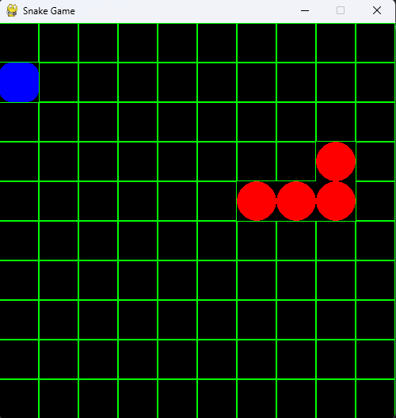
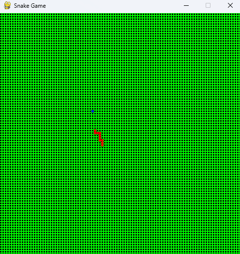
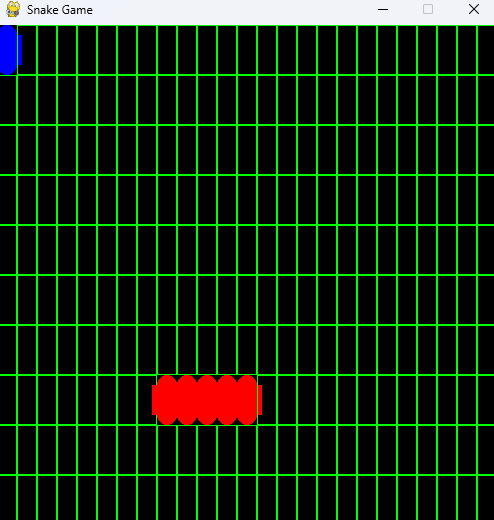
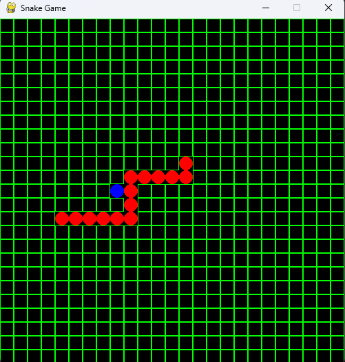
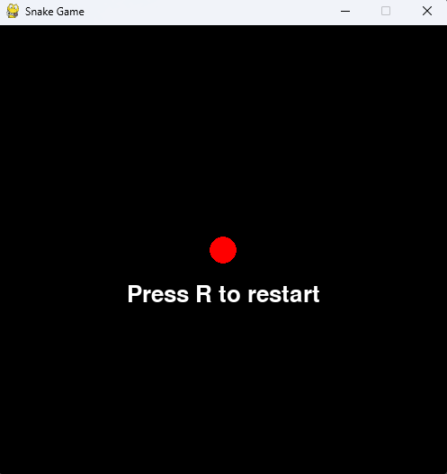

# Snake_Pygame
Snake Game coded in python with pygame.

Game Controls:

Player:  
W : UP  
S : DOWN  
A : Left
D : Right

R : Restart when hit self or walls

Game while running With variations of map size:

Game End Screen:

